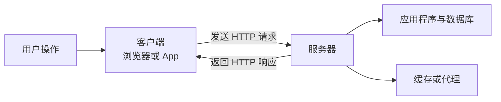
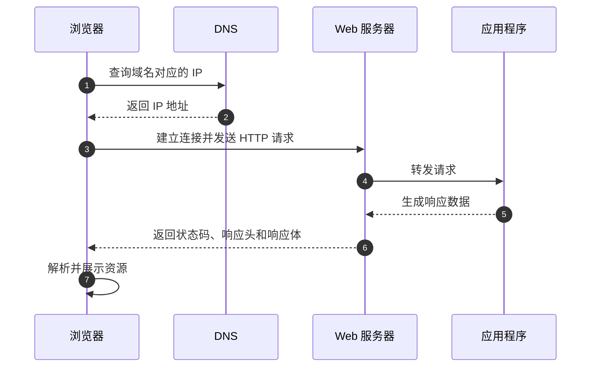
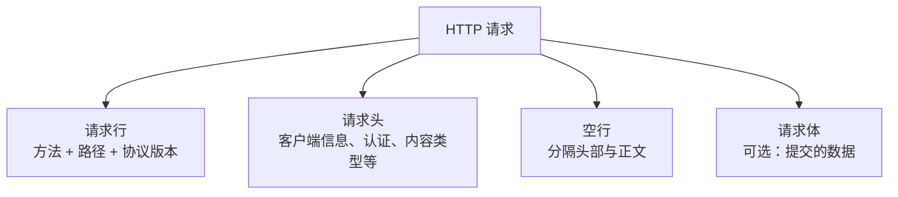
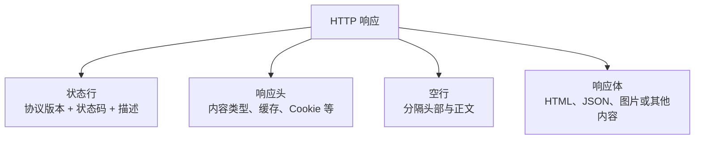
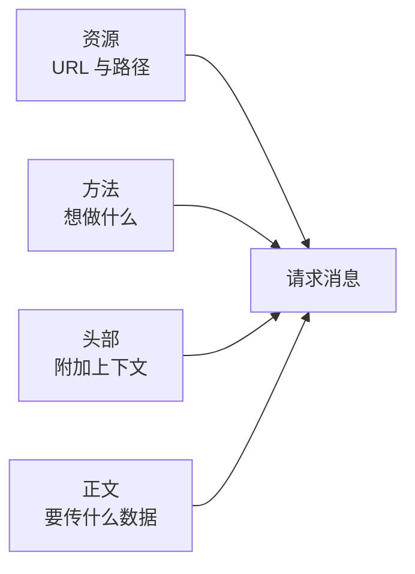
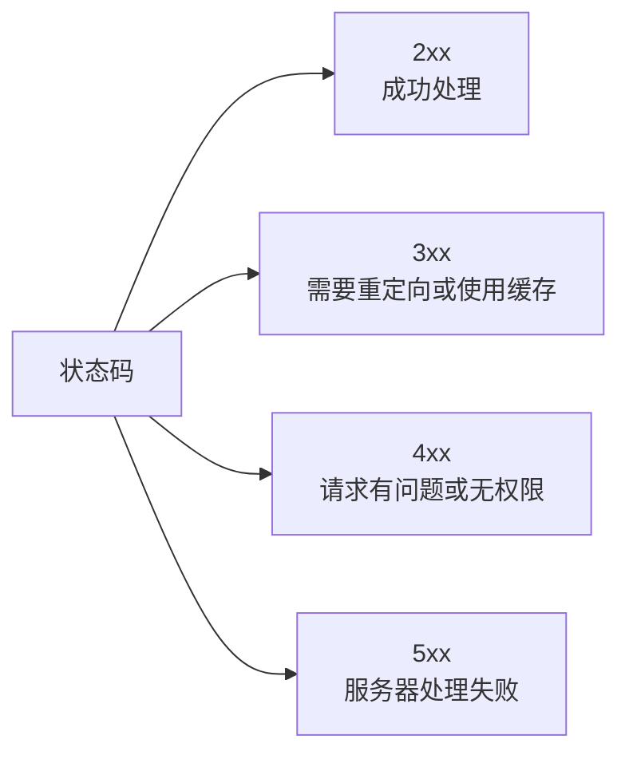
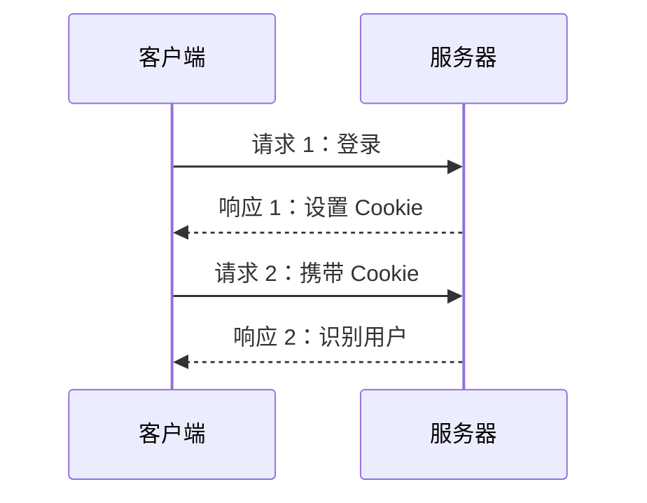
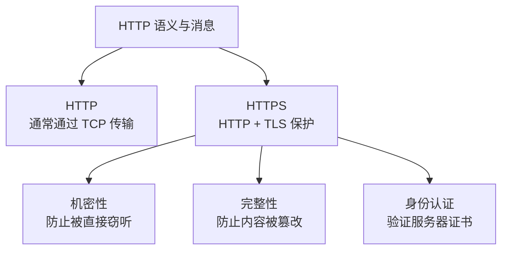
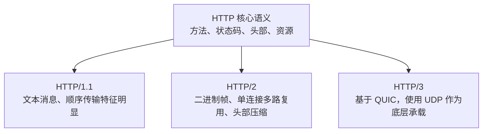
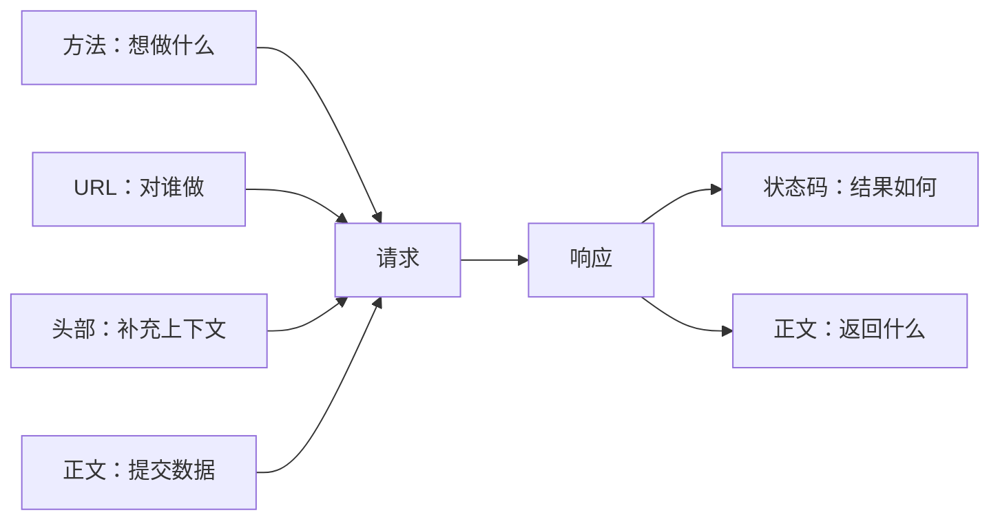

# HTTP：用几张图快速理解 Web 的通信方式

> HTTP 是一种无状态的请求/响应协议：客户端表达意图，服务器处理请求并返回结果。

## 学完你应该理解什么

- 浏览器和服务器如何完成一次 HTTP 通信
- HTTP 请求和响应分别由什么组成
- 方法、状态码、请求头和请求体分别解决什么问题
- HTTP、HTTPS、HTTP/1.1、HTTP/2、HTTP/3 的关系

## 先建立整体认识

HTTP 位于应用层。它规定消息的语义和格式，但不负责域名解析，也不等同于 TCP、TLS 或浏览器本身。



一次通信的核心只有两条边：客户端发请求，服务器回响应。请求和响应中携带的内容，才是 HTTP 交互的主体。

## 一次请求是怎么发生的

下面省略了连接复用、重试和缓存命中等特殊情况，只展示最基本的路径：



注意：DNS 是“找到服务器”的过程，不是 HTTP 本身；HTTP 真正开始于客户端发送请求消息。

## HTTP 消息长什么样

### 请求



一个实际的请求可以写成：

```http
POST /api/users HTTP/1.1
Host: example.com
Content-Type: application/json

{"name":"Ada"}
```

### 响应



```http
HTTP/1.1 201 Created
Content-Type: application/json

{"id":42,"name":"Ada"}
```

## 四个核心部件

可以把 HTTP 请求理解成“对哪个资源，用什么意图，附带什么上下文，提交什么内容”：



### 方法：表达意图

| 方法 | 常见意图 | 通常是否改变服务器状态 |
|---|---|---|
| `GET` | 获取资源 | 否 |
| `POST` | 创建资源或提交动作 | 可能 |
| `PUT` | 用完整内容创建或替换资源 | 可能 |
| `PATCH` | 局部修改资源 | 可能 |
| `DELETE` | 删除资源 | 是 |

方法不是 URL 的装饰，而是请求语义的一部分。服务器应该根据方法理解客户端的意图。

### 状态码：说明结果



常见例子：

- `200 OK`：成功返回结果
- `201 Created`：成功创建资源
- `204 No Content`：成功，但没有响应正文
- `301` / `302`：重定向
- `400 Bad Request`：请求格式或参数有问题
- `401 Unauthorized`：需要身份认证
- `403 Forbidden`：服务器拒绝访问
- `404 Not Found`：目标资源不存在
- `500 Internal Server Error`：服务器内部错误

状态码只描述处理结果，不等于业务结果的全部细节。比如一个业务失败也可能用 `200` 返回 JSON，这时还需要看响应体中的业务字段。

## HTTP 是无状态的

“无状态”表示：单个请求的语义原则上可以独立理解，服务器不应仅凭连接本身推断之前发生过什么。



登录状态不是 HTTP 自动记住的，而是通过 Cookie、Session、Token 等机制由应用补充。HTTP 提供传递这些信息的方式，但不替应用决定身份系统。

## HTTP 与 HTTPS 的关系



HTTPS 不是另一套业务语义，而是让 HTTP 消息通过 TLS 获得保护。加密连接也不会自动修复应用层的权限错误、越权或注入漏洞。

## HTTP 的主要版本

三种主要版本共享核心 HTTP 语义，但使用不同的消息和传输机制：



初学时先掌握“请求/响应、方法、状态码、头部、正文”这套共同语义，再理解不同版本的性能差异。

## 一个完整的 API 示例

客户端创建用户：

```http
POST /api/users HTTP/1.1
Host: api.example.com
Authorization: Bearer <token>
Content-Type: application/json
Accept: application/json

{"name":"Ada","email":"ada@example.com"}
```

服务器返回：

```http
HTTP/1.1 201 Created
Content-Type: application/json
Location: /api/users/42

{"id":42,"name":"Ada","email":"ada@example.com"}
```

阅读这个例子时，可以依次问：

1. 用什么方法表达意图？`POST`
2. 目标资源是什么？`/api/users`
3. 客户端提交了什么？请求体中的 JSON
4. 结果如何？`201 Created`
5. 新资源在哪里？`Location` 头部指向 `/api/users/42`

## 常见误区

| 误区 | 更准确的理解 |
|---|---|
| HTTP 就是网页 | HTTP 也可以传 JSON、图片、音频和文件 |
| URL 就是 HTTP | URL 标识资源；HTTP 定义如何与资源交互 |
| HTTPS 是一种完全不同的协议 | HTTPS 是受 TLS 保护的 HTTP 通信 |
| HTTP 会自动记住登录状态 | HTTP 无状态，登录状态需由 Cookie、Session 或 Token 等机制维护 |
| `200` 就代表业务成功 | `200` 只代表 HTTP 层成功，业务结果还要看响应体 |
| HTTP/2 和 HTTP/3 改变了所有方法语义 | 主要变化是消息编码和传输机制，核心语义仍然共享 |

## 记忆要点



一句话记忆：

> HTTP 就是客户端围绕某个资源发送带有意图的请求，服务器返回带有处理结果的响应。

## 自测问题

1. `GET /users/42` 中，方法和资源分别是什么？
2. 为什么说 HTTP 是无状态的？登录状态通常由什么机制补充？
3. `Content-Type` 和 `Accept` 分别描述哪一方的内容？
4. `401` 和 `403` 在语义上有什么区别？
5. HTTP/2、HTTP/3 主要改变了什么？

## 参考规范

- [RFC 9110：HTTP Semantics](https://www.rfc-editor.org/rfc/rfc9110.html)
- [RFC 9112：HTTP/1.1](https://www.rfc-editor.org/rfc/rfc9112.html)
- [RFC 9113：HTTP/2](https://www.rfc-editor.org/rfc/rfc9113.html)
- [RFC 9114：HTTP/3](https://www.rfc-editor.org/rfc/rfc9114.html)
